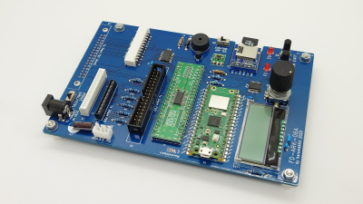
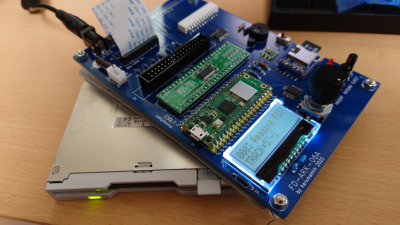
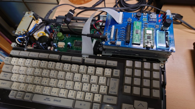

# FD-ARK
by Harumakkin. 2023/08/29


**fig.1 FD-ARK-06A**

## What's is this
FD-ARKは、FDDコントローラー＆FDDエミュレーターです。エミュレーターもしくはコントローラの二つの機能を持ち、基板上にある MODE SWによってどちらの機能を使用するかを利用者が選択します。

### （A）FDDコントローラーとしての機能
- MODE SWを"CTRL"にして電源を入れると、FD-ARKはFDDコントローラーとして動作します
- FD-ARKにFDD（フロッピーディスクドライブ）を接続し、2DDフロッピーディスク[^1]から全トラックデータを読み込んでSDカードに保存することができます。保存したデータをフロッピーに書き戻すこともできます。
- SDカード内でフロッピーディスク毎にフォルダ分けする機能がありますで、複数のフロッピーディスクを読み込、SDカードに保存することができます。
- 保存するフォルダは番号で管理されており、ロータリーエンコーダをつまんで回すことでその番号を選ぶことができます。
[^1]:2HDフロッピーディスクには対応していません。


**fig.2 FD-ARK-06A with floppy disk drive**

### （B）FDDエミュレーターとしての機能
- MODE SWを"EMU"にして電源を入れると、FD-ARKはFDDエミュレーターとして動作します
- MSX turboR[^2]で、内臓FDDを取り外してFD-ARKを接続することで、FDDの代わりとして機能します。
- FDデータは、FDDコントローラー機能であらかじめSDカード内に保存しておく必要があります。
- MSX本体にアクセスさせるFDデータは、ロータリーエンコーダを回して指定できます。
[^2]:FS-A1STのみで動作確認を行っています。MSX2+ FS-A1WX/FS-A1WSX, MSX turboR FS-A1GT でも動作するはずです。


**fig.3 FD-ARK-06A with MSXturboR**

## 利用時の注意事項
- MODE SWに切り替えはFD-ARKの電源が切れているときのみ行うことができます。
- また、MSX本体にFD-ARKをつないだままFDDコントローラーに切り替えたり、FDDをFD-ARKをつないだままFDDエミュレーターに切り替えないでください。MSX本体やFDD、FD-ARKが破損する可能性があります。
- MicroSDカードはFATで形式でフォーマットしてください
- イレギュラーなことへの対処はあまり対応していません、FDDアクセス中にフロッピーディスクを抜くとか、SDカードをアクセス中に抜くなどを行うと、FD-ARKやMSX本体がフリーズしたりします。

## FD-ARKを作る
部品表にある部品の収集、プリント基板の製造、組み立て、ファームウェアの書き込みの作業が必要です。完成品はありません。
PCBを発注できて、SOPチップをはんだ付けで来て、Raspberry Pi Picoにu2fファイルを書き込みができる必要があります。

## FD-ARKを使う
### フロッピーディスクを読み込んでＳＤカードに保存する方法(FDDコントローラー)
1. FD-ARKのMODE SWを "CTRL" に切り替えます
1. FD-ARKに、MicroSDカードを装着します。MicroSDカードはWindowsPCなどで事前に FAT 形式でフォーマットしてください。
1. FDDを装着します。FDDは、J2、J3、J4のいずれかのコネクタに接続します。使用実績のあるFDDとその接続箇所はTable 1を参照ンしてください。
1. FD-ARKに、DC5V電源（センタープラス）を接続して電源を入れます
1. LCD画面には、
0001(no file
[←FD][→FD]
と表示されているはずです。
[←FD] の部分が[(空欄)]で表示されている場合は、SD-WPスイッチをOFFに切り替えます。[←FD]が表示されるはずです。
SD-WPスイッチは、SDカードへの書込禁止／許可を切り替えるスイッチです。
1. 読み込みたいフロッピーディスクをFDDへ挿入します。念のためフロッピーディスクのライトプロテクトはＯＮしてください
1. ロータリーエンコーダーを回してフロッピーディスクから読み込んだデータを格納するフォルダを決めます。0001から9999まで選択できます。
1. [←FD] スイッチ（INSERTとシルク印字されているスイッチ）を押します。FDDから読み込みが開始されます。
1. 両面80トラック(全160トラック)の読み込みが完了すると、完了音が鳴り、Completed と表示されます。
1. EJECTとシルク印字されているスイッチを押して、元の画面に戻ります。
1. 格納されたフォルダでは、画面に"FD-DATA"と表示されます。
ex) 0001 FD-DATA
1. 別のFDを読み込みたい場合は、別のフォルダを選択して同様の操作を行います。（どの番号にどのF\フロッピーを読み込んだかは別途メモしておいてください）
1. SDカードをWindowsPCなどで参照すると、\FD-ARK\XXXX フォルダが生成されています。XXXXは保存先に選択したフォルダの番号です。
1. \FD-ARK\XXXX フォルダ内には、COMMENT.TXT と複数のTKnnnn-n.DAT ファイルが生成されています。
1. COMMENT.TXTはLCDに表示されるフォルダ名称が格納されています。編集することができます（半角英数字のみ）。COMMENT.TXTファイルに書き込まれた内容がLCDに表示されるようになります。
### フロッピーディスクへ書き戻す方法(FDDコントローラー)
1. ライトプロテクトをOFFしたフロッピーディスクをFDDに入れます。
1. フロッピーディスクへ書き込むディスクイメージを選択します。
1. [→FD]スイッチ（RETURNとシルク印字されているスイッチ）を押します。FDDへの書き込みが開始されます。

**Table 1. FDDコントローラー・モードで実績のあるFDD**
||型番|メーカー|備考|
|:-:|:-|:-|:-|
|J2|YD-702D-6238D|YE DATA|J8をFDDの電源につなげる|
|J2|D353M3D|MITSUMI|J8をFDDの電源につなげげる|
|J3|EME213MU|Matsushita Electronic Components|FFC 1.25mmピッチ,24ピン,電極逆面を使用する|
|J4|YD-702J-6637J|YE DATA|FFC 1.00mmピッチ,26ピン,電極逆面を使用する||

### MSX本体に接続してフロッピーディスクの代わりとして使用する(FDDエミュレータ)
1. FD-ARKのMODE SWを "EMU" に切り替えます
1. FD-ARKに、MicroSDカードを装着します。事前にFDDコントローラーモードでなにがしかのフロッピーディスクイメージを保存しておく必要があります。
1. FD-ARKのJ5とMSX本体をフラットフレックスケーブルで接続します。動作確認を行った機種はFS-A1STのみです
1. FD-ARKに、DC5V電源（センタープラス）を接続して電源を入れます
1. ロータリーエンコーダーを回して、使用したいフロッピーディスクイメージを選択します。[INSERT]スイッチを押すと選択が確定します（フロッピーディスクをドライブに入れている状態になる）。INSERTされているディスクイメージは番号の前に"*" が表示されます。この状態でロータリーエンコーダーを回して別の番号を表示しても、"*"が表示されているフロッピーディスクイメージがそのまま使用されます。
ex) *0001 FD-DATA
1. [EJECT]スイッチを押すと、フロッピーディスクを取り出した状態にすることができます。
1. MSX本体の電源を入れます。
1. フロッピーディスクイメージを選択していて、そのイメージがブート可能な内容ならそのフロッピーディスクの内容が起動するはずです。

### MicroSDカード
FDDコントローラーモードでディスクイメージをSDカードに保存すると、SDカードにはFD-ARKフォルダが作成され、ディスクイメージはそのフォルダ内に作成される番号フォルダに下記込まれます
```
FD-ARK/
  ├ 0001/
  ├ 0002/
      :
```
番号フォルダ内には、160個のTKnnnn-n.DATファイルとCOMMENT.TXTファイルが格納されています。
１トラックにつき１つのファイルで、TKnnnn-n.DATはフロッピー１トラック分のデータですnnnnはトラック番号。-nはサイド番号です。
.DATファイルの先頭には少しの管理情報と、FDDのREAD DATA端子から出力されているデータを4MHzでサンプリングした情報がそのまま格納されています。
セクタ構造など一切確認作業を行わず生の出力データをそのまま保存しているので.DATファイルの内容が正しいかどうかの保障はありません。


## LICENSEと利用に関する注意事項
1. FD-ARKのファームウェアとそのソースコード、回路図データおよび資料ファイルは MIT License で配布されます。ただし、FD-ARK は、FatFsを使用しています。FatFsのソースコードの扱いに関してはFatFsのLICENSEに従ってください。
2. 本作品は同人ハードウェア＆ソフトウェアです。本作品の設計およびソフトウェアは品質を保証していません。MSX本体、フロッピーディスクドライブ、およびフロッピーディスクとそのデータが故障、破損したとしても自身で責任を負える方のみ本作品をご利用ください。特にハードウェアの製作を伴いますのでリスクがあります。製作の腕に自身のある方のみご利用ください。
3. 本作品の設計資料とソースコードの改変や改造、また、別の作品への利用、商用利用は自由です。ただし、1. 2.の制限を超える利用は各自でその責任と義務を負ってください。

## FD-ARKが使用しているソフトウェア
### FatFs
Copyright (C) 20xx, ChaN, all right reserved.
http://elm-chan.org/fsw/ff/00index_e.html

## 余談
1. FD-ARK製作の経緯：
当初、FDX68シールドという作品がBOOTHで売られていて[^3]、その装置はフロッピーディスクを読みだすことができ、またFDDエミュレータとして使用することもできるものらしいという漠然とした知識だけありました。そういう物があるのかぐらいに捉えていて、自身は必要性を感じていませんでした。しかしある時にふとゲーム保存協会のツイート[^4]が目にとまり、国立国会図書館@NDLJPフロッピーディスク長期保存対策に関する調査報告書というの知りました。これには様々な理由でフロッピーディスクは劣化するものであり、劣化するとフロッピーディスクは使用できなくなってしまうと書かれていました。自身が所有しているMSXに関するフロッピーディスクは30年を超えている物が多く、報告書との出会いは、結果、これらフロッピーディスクに危機感を募らせてしまうことになりました。FDX68シールド、ぜひとも欲しいとなったわけですが、いつも売り切れでこれがなかなか購入できません。調査報告書では似たようなツールにKryoFluxというものを紹介していました。それが公式ページから今でも購入可能と書かれていたので、購入してみることにしました。ただちゃんと調べてから購入すれば良かったのですが、てっきりFDX68のようにKryoFluxにもFDDエミュレータの機能があると思い込んでいてこれが失敗でした。発注後に取説書読んでそれに気が付いたわけですが、同時にFDDって意外とシンプルな仕組みなんだとその時に知りました。これならKryoFluxで読み込んだデータを使用するFDDエミュレータを自分でも作れるだろう、いや作ってしまえと思うに至りました。しっかり作ろうとすると細部が大変になりますのでフロッピーディスクのイメージ化機能もいっしょに作ってしまえば、データフォーマットも独自定義できるしもっと楽に作れると思い、結果、今回のFD-ARKになりました。KryoFluxはKryoFluxで、FD-ARKが失敗した時のためにとフロッピーディスクのイメージ化に今でも使用しています。また、FD-ARKで読み出して、そして書き出した後に、正しく読み書きできているかをKryoFluxでチェックするなんてことに使用しています。
自分自身が所有するフロッピーディスクのためだけに作成したので、3.5"2DD以外の対応は考えていません。
[^3]: https://booth.pm/ja/items/4451666
[^4]: https://twitter.com/gamepres/status/1648638490765295619


2. FDアーカイバを意味した"FD-ARC"と命名するつもりが、間違って"FD-ARK"と名付けてしまいました。ただ、"ARK"は聖書に出てくる十戒石板をおさめた箱を意味するので、大事な物をしまっておくという意味で FD-ARK のままとしました。


